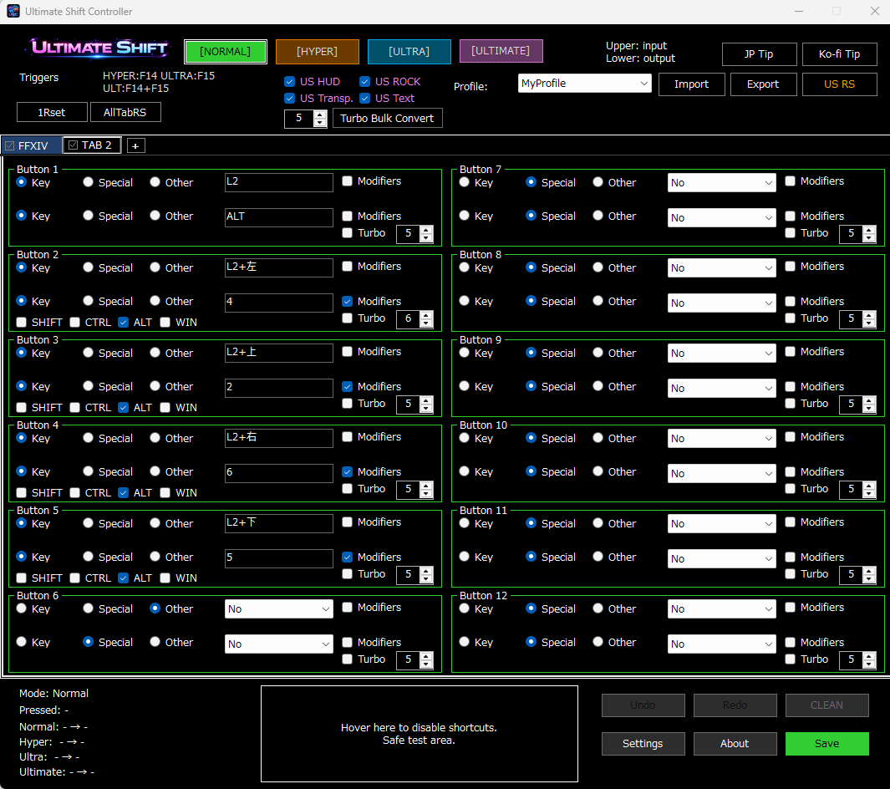
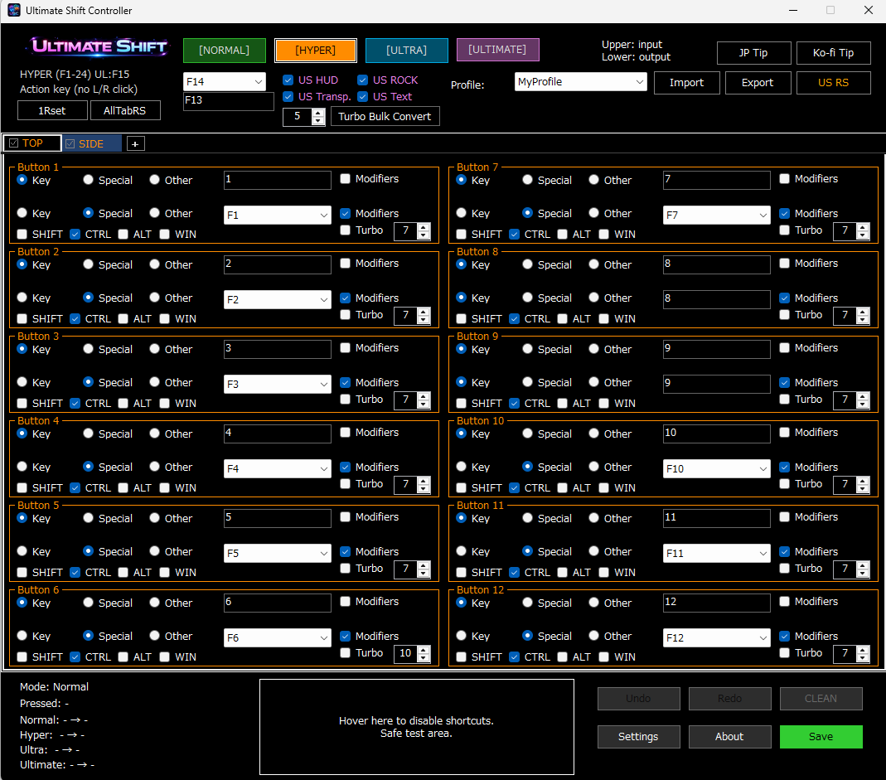
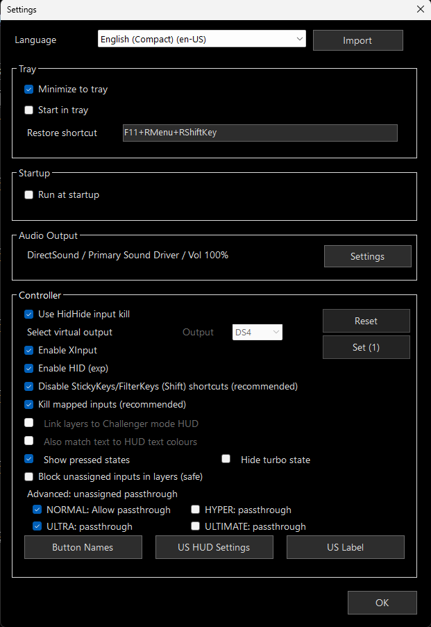
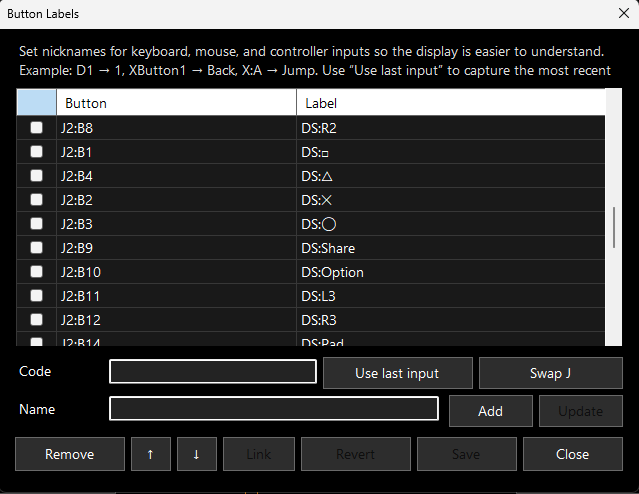
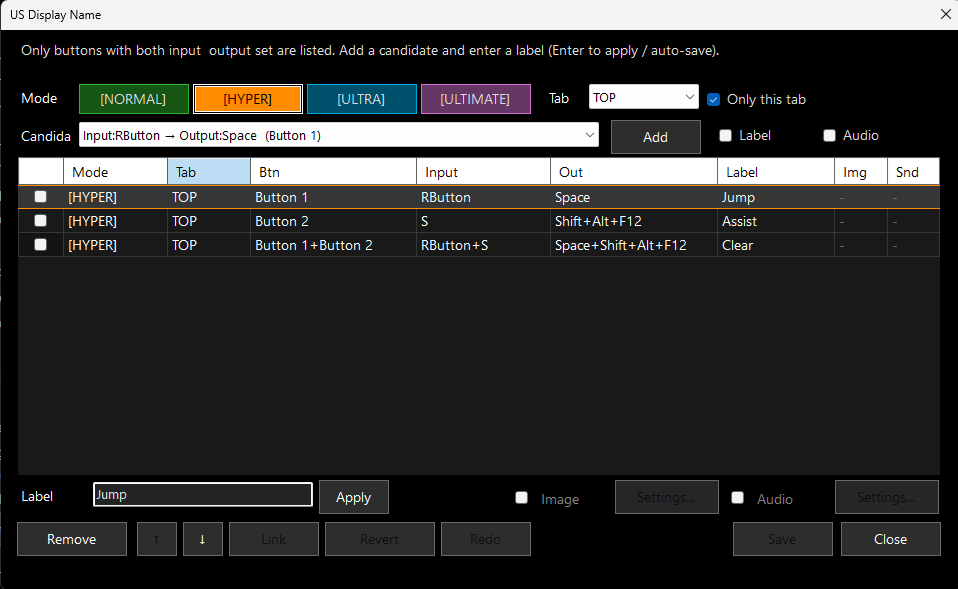
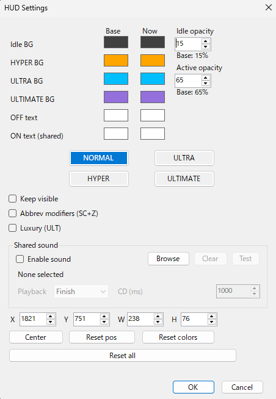
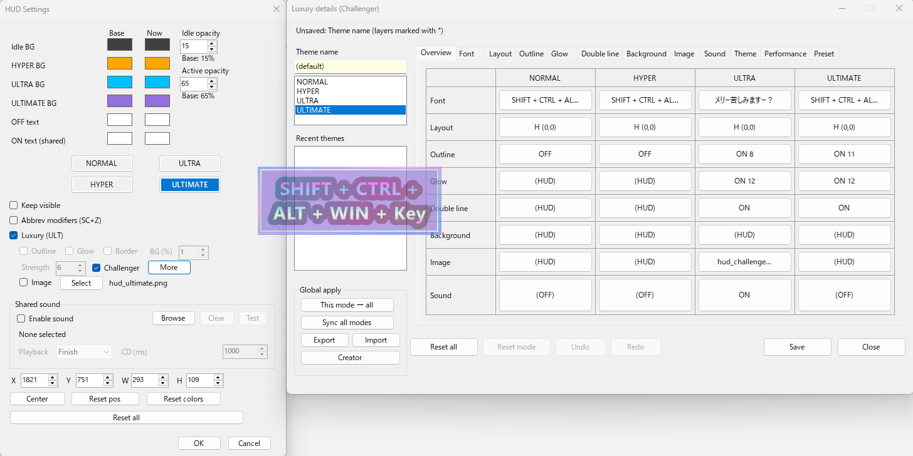
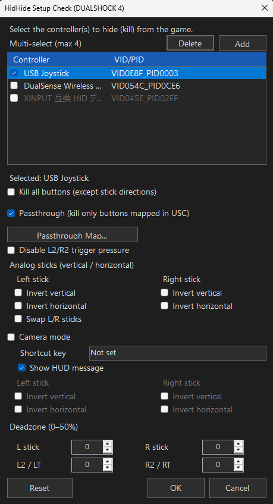
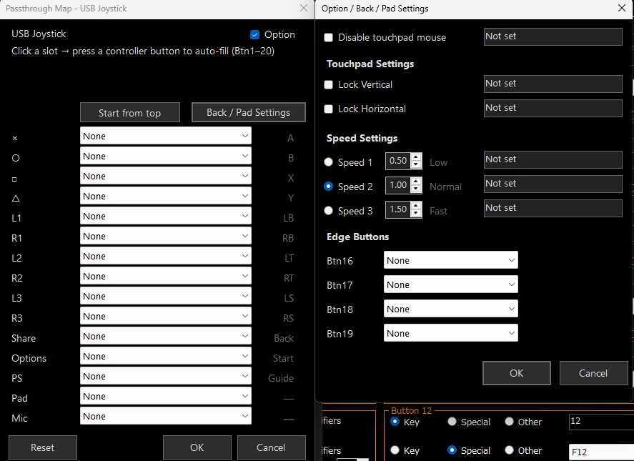
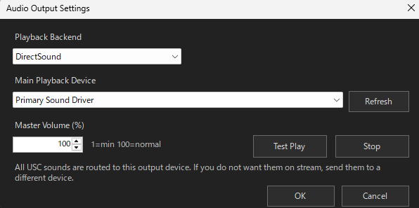

# Ultimate Shift Controller

**Ultimate Shift Controller** is a lightweight Windows input remapping tool.  
It uses a **4-layer system** — **NORMAL / HYPER / ULTRA / ULTIMATE** — to expand input behavior in a way that is easier to organize and understand.

It is designed to combine **practical input support** with **clear visual HUD feedback**.  
It also supports **US Labels**, **button display aliases**, **images**, **sound**, and **enhanced HUD styling**.

---

## Main Features

- **4-layer input structure**
  - NORMAL
  - HYPER
  - ULTRA
  - ULTIMATE

- **Input remapping support**
  - Controller → Keyboard
  - Controller → Controller
  - External helper device integration

- **Visual feedback features**
  - US HUD
  - US Labels
  - Custom button display names
  - Image / sound / enhanced display options

- **Virtual controller related features**
  - Virtual controller output
  - Passthrough configuration
  - HidHide integration
  - DualSense-related options

- **Audio output settings**
  - HUD mode-switch sounds
  - Label sounds
  - Output device selection
  - Volume control

---

## Screenshots and Screen Guide

---

### 1. Main Screen

This is the **main configuration screen** of USC.  
You can configure **input** and **output** for each button while checking everything in a single list view.

At the top of the window, you can control:

- **NORMAL / HYPER / ULTRA / ULTIMATE** layer switching
- **US HUD**
- **Profile switching**
- **Import / Export**

At the bottom, you can access:

- **Status display**
- **Settings**
- **Overview**
- **Save**

This is the screen you will use most often for day-to-day setup work.

---

### 2. Hyper Shift Setup

The **HYPER layer** lets you create a separate operation layer on top of normal input.  
**ULTRA** can be configured in the same way.

#### Basic example with an external device

First, on the **NORMAL layer**, set:

- **Button 1 = F1 → F13**

Then, on your mouse or external helper device, assign **F13** to the button you want to use as the Hyper trigger.

After that, in USC, set:

- **Trigger key = F13**
- **HYPER key = F14**

This makes it easier to call **HYPER actions** from the external device side.

**ULTRA can be set up using the same idea.**

This kind of setup can work with:

- helper mouse software
- keypad / sub-device environments
- **Razer Synapse 2**
- other key-assignment tools that can output function keys

#### Recommended controller-style setup

When using a controller, it is often practical to use the **virtual controller** feature and assign:

- **L1 = HYPER**
- **R1 = ULTRA**
- **L1 + R1 together = ULTIMATE**

This makes layer switching easier to understand and easier to use in practice.

---

### 3. Main Settings Screen

This is the **main settings screen** for USC.

From here, you can configure things such as:

- **Language selection**
- **Task tray behavior**
- **Startup behavior**
- **Audio output settings**
- **Controller input settings**
- **Virtual controller settings**
- **Pressed-state display**
- **Transparency for unassigned input**

You can also open these related screens from here:

- **Button Name Settings**
- **US HUD Settings**
- **US Label Change**

---

### 4. Button Name Settings

This screen is used to assign **easier display names (nicknames)** to keyboard, mouse, and controller input codes.

For example:

- `J2:B3` → `DS:Circle`
- `J2:B9` → `DS:Share`

This is useful when you want HUD and pressed-state displays to be **easier to read**.

---

### 5. US Label Change Screen

This screen lets you manage configured button entries inside the current tab and assign **display labels** to them.

You can organize:

- **Input**
- **Output**
- **Display name**
- **Image**
- **Sound**

For example, adding names like:

- `Jump`
- `Assist`

makes HUD-related display much more intuitive.

---

### 6. US HUD Settings

This screen is used to adjust the **basic HUD display**.

You can configure things such as:

- **Background colors for NORMAL / HYPER / ULTRA / ULTIMATE**
- **Text colors**
- **Transparency**
- **Display position**
- **Size**
- **Always-on display**
- **Modifier key joined display**
- **Layer switch sounds**

This is the main place for building a readable and practical HUD.

---

### 7. Challenger HUD Screen

This is the detailed screen for creating **enhanced ULTIMATE-style HUD effects**.

Here you can fine-tune:

- **Fonts**
- **Layout**
- **Outline**
- **Glow**
- **Double lines**
- **Background**
- **Images**
- **Sound**
- **Themes**

This is useful not only for status display, but also for **streaming** and **visual presentation** setups.

---

### 8. Virtual Controller Screen

This screen is used together with **HidHide** to control which controller the game should see.

You can adjust things such as:

- which controller to hide
- which inputs to passthrough
- stick / trigger handling
- analog stick options
- shortcut behavior
- HUD-related integration

This is an important screen when organizing **physical** and **virtual** controller behavior.

---

### 9. Virtual Controller / Passthrough / DualSense Options

This screen is used for virtual controller output configuration and **DualSense-specific options**.

You can configure things such as:

- **Passthrough target settings**
- **HID / XInput enable options**
- **Button assignments**
- **Pad settings**
- **Touchpad mouse conversion**
- **Speed settings**
- **Dedicated button options**

This is useful when you want more detailed control over **DualSense behavior**.

---

### 10. Audio Output Settings

This screen is used to configure how USC outputs sound.

You can set:

- **Playback method**
- **Main playback device**
- **Master volume**

Use this when you want to control where **HUD switch sounds** and **label sounds** are sent.

---

## Recommended Usage Style

USC is designed not only for simple one-button remapping,  
but especially for setups where you **expand your controls through layers**.

In particular, USC becomes easier to take advantage of when you combine ideas like:

- calling **HYPER / ULTRA** from external helper devices
- using a **virtual controller** to make layer input more practical
- using the **HUD** to keep track of the current state
- improving visibility with **US Labels** and **button display aliases**

---

## Notes

This README is based on the **English UI screenshots** included in the repository.  
Image files are referenced from the **`img` folder** using relative paths.
