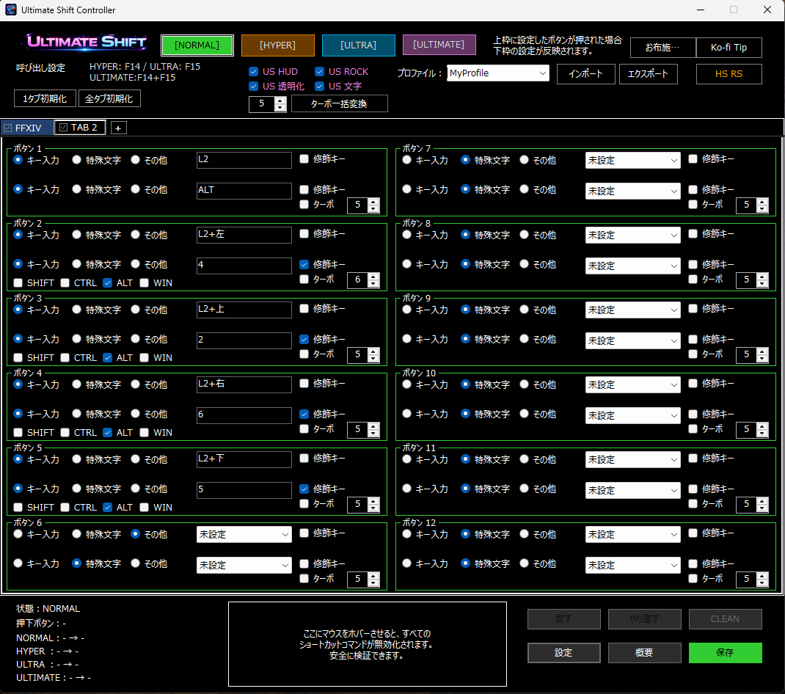
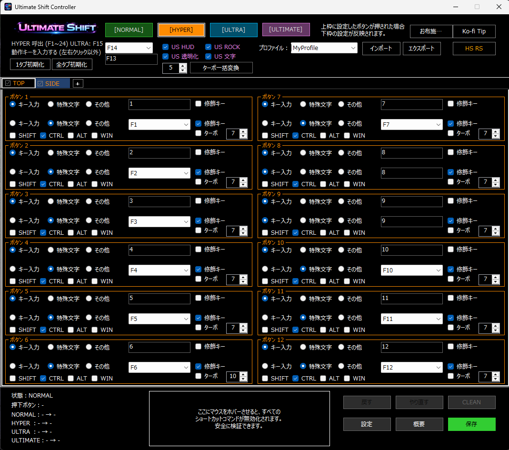
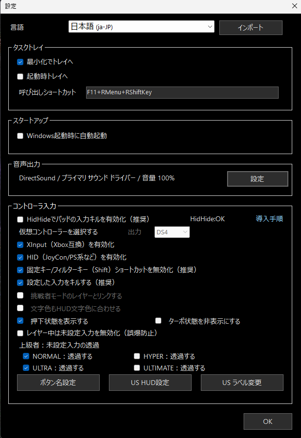
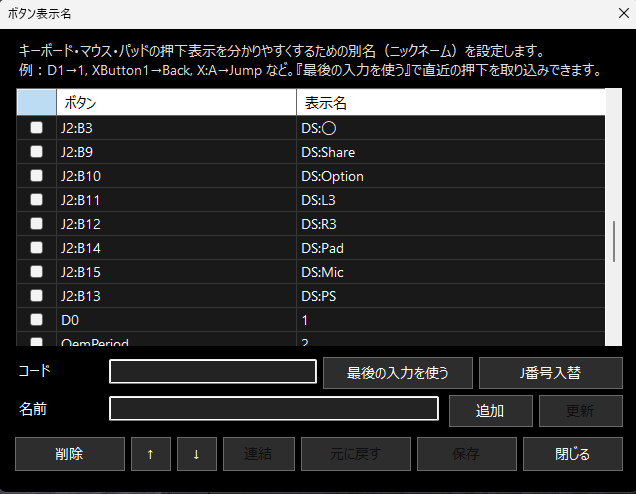
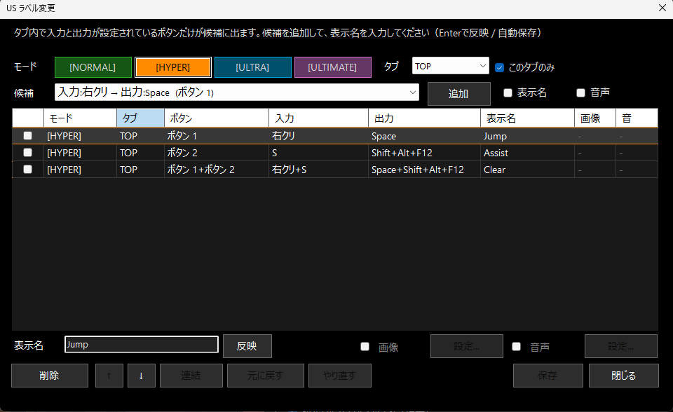
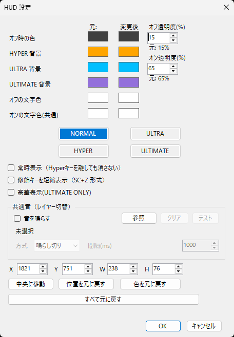
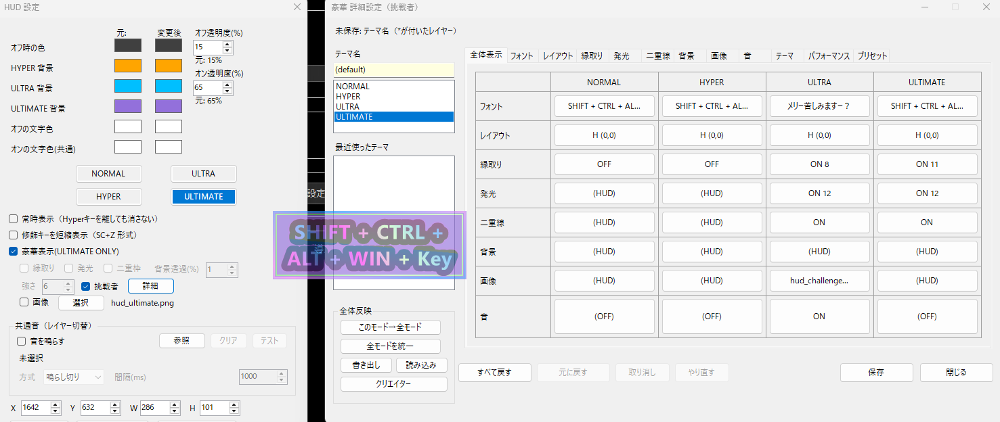
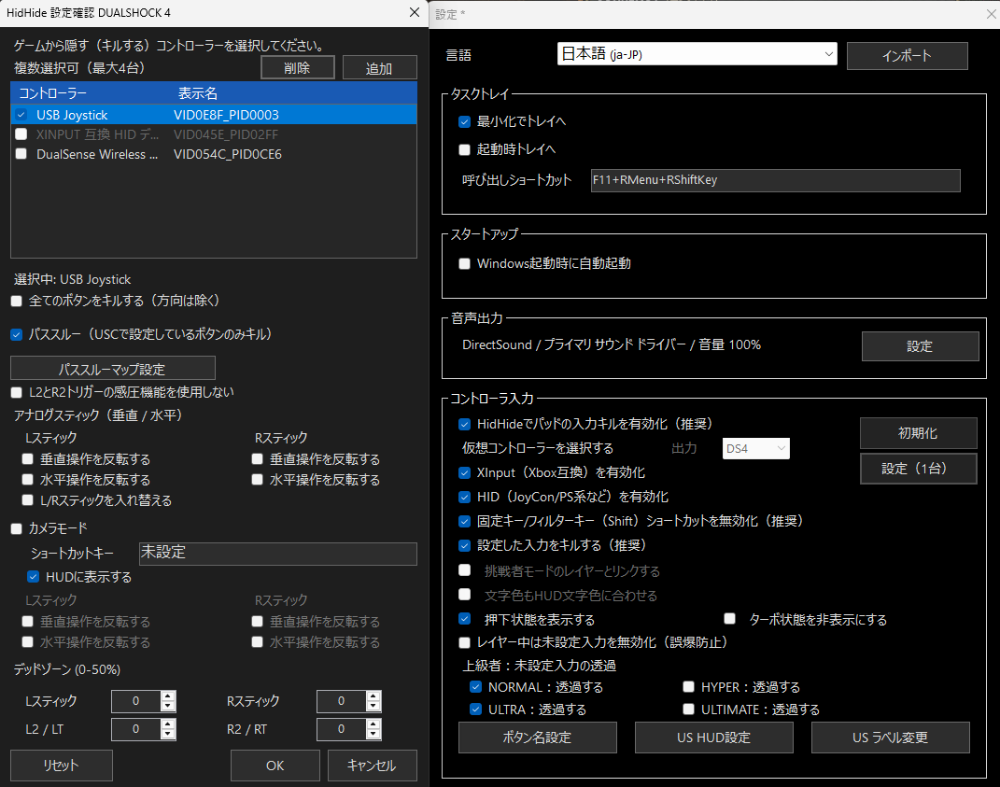
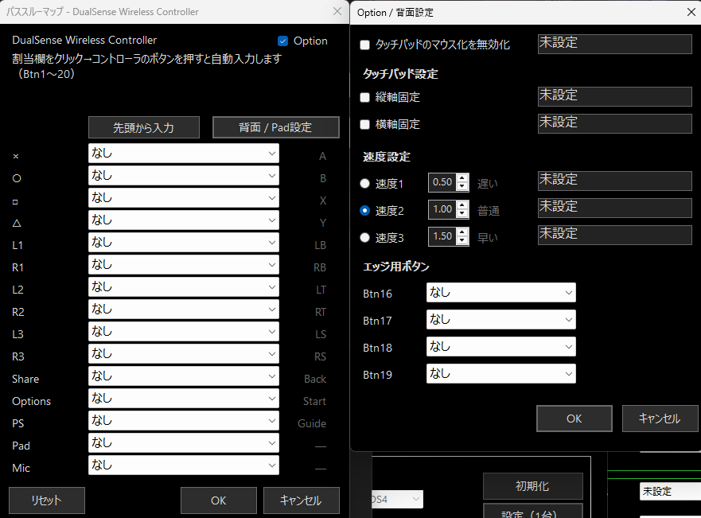
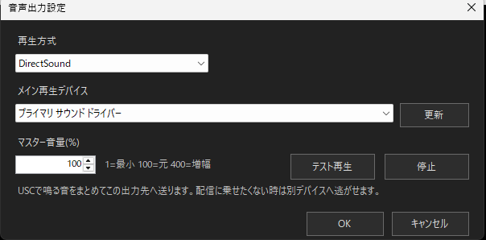

# Ultimate Shift Controller

**Ultimate Shift Controller** は、Windows向けの軽量な入力変換ツールです。  
**NORMAL / HYPER / ULTRA / ULTIMATE** の4レイヤー構成を使い、  
コントローラー・キーボード・マウス・補助デバイスの入力を、分かりやすく拡張できます。

**実用的な入力補助** と **視覚的に分かりやすいHUD表示** を両立しているのが特徴です。  
さらに、**USラベル / ボタン表示名 / 画像 / 音 / 豪華HUD表示** などにも対応しています。

---

## 主な特徴

- **4レイヤー構成**
  - NORMAL
  - HYPER
  - ULTRA
  - ULTIMATE

- **入力変換に対応**
  - コントローラー → キーボード
  - コントローラー → コントローラー
  - 補助デバイスとの連携

- **視覚的に分かりやすい表示機能**
  - US HUD
  - USラベル
  - ボタン表示名の別名設定
  - 画像 / 音 / 豪華表示

- **仮想コントローラー関連機能**
  - 仮想コントローラー出力
  - パススルー設定
  - HidHide連携
  - DualSense系の追加設定

- **音声出力設定**
  - HUD切替音
  - ラベル音
  - 出力デバイス選択
  - 音量調整

---

## スクリーンショットと画面説明

---

### 1. メインページ

USCの**メイン設定画面**です。  
各ボタンごとに、**入力内容** と **出力内容** を一覧で確認しながら設定できます。

上部では、  
**NORMAL / HYPER / ULTRA / ULTIMATE のレイヤー切替**、  
**US HUD**、**プロファイル切替**、**インポート / エクスポート** などをまとめて操作できます。

下部では、**状態表示**、**設定**、**概要**、**保存** など、  
日常的に使う基本操作を行えます。

---

### 2. ハイパーシフト設定

**HYPERレイヤー** を使うと、通常入力とは別の操作レイヤーを作れます。  
**ULTRA** も同じ考え方で設定できます。

#### 外部デバイスと組み合わせる基本例

最初に、**NORMALレイヤー（通常入力）** で  
**ボタン1を F1 → F13 に設定** します。

その後、マウスやサブデバイス側で、  
**HYPER化したいボタンに F13 を割り当て** ます。

さらに USC 側で、

- **起爆キーを F13**
- **HYPERキーを F14**

として設定すると、  
外部デバイス側から **HYPER操作** を呼び出しやすくなります。

**ULTRAも同様の考え方で設定可能** です。

この構成は、  
**マウス補助ソフト** や **左手デバイス** だけでなく、  
**Razer Synapse 2** のようなキー割り当て環境でも使えます。

#### コントローラーで使う場合のおすすめ例

コントローラーでは、**仮想コントローラー機能** を使い、

- **L1 = HYPER**
- **R1 = ULTRA**
- **L1 + R1 の同時押し = ULTIMATE**

という形にすると、  
レイヤーの切替が分かりやすく、実用的に使いやすくなります。

---

### 3. 設定メイン画面

USC全体の**基本設定画面**です。

ここでは主に以下をまとめて設定できます。

- **言語切替**
- **タスクトレイ設定**
- **起動時動作**
- **音声出力設定**
- **コントローラー入力設定**
- **仮想コントローラー設定**
- **押下状態表示**
- **未設定入力の透過**

さらに、以下の各画面へもここから移動できます。

- **ボタン名設定**
- **US HUD設定**
- **USラベル変更**

---

### 4. ボタン名設定画面

キーボード・マウス・パッドの押下表示を、  
**分かりやすい別名（ニックネーム）** に置き換えるための画面です。

たとえば、

- `J2:B3` → `DS:○`
- `J2:B9` → `DS:Share`

のように、実際のコードを**見やすい名前**へ変更できます。

HUDや状態表示で、  
**実際に何を押しているか分かりやすくしたい時** に便利です。

---

### 5. USラベル変更画面

タブ内で入力と出力が設定されているボタン候補を一覧表示し、  
**表示名を付けるための画面**です。

ここでは以下をまとめて管理できます。

- **入力**
- **出力**
- **表示名**
- **画像**
- **音**

たとえば、  
`Jump` や `Assist` のような表示名を付けることで、  
HUDや表示系をより**直感的** にできます。

---

### 6. US HUD設定画面

HUDの**基本表示**を調整する画面です。

以下のような項目を設定できます。

- **NORMAL / HYPER / ULTRA / ULTIMATE の背景色**
- **文字色**
- **透過度**
- **表示位置**
- **サイズ**
- **常時表示**
- **修飾キー連結表示**
- **レイヤー切替音**

日常使用で見やすいHUDを作るための、  
**基本的な調整画面** です。

---

### 7. HUDの挑戦者画面

**ULTIMATE系の豪華表示** を、より細かく作り込むための詳細画面です。

ここでは以下のような項目を個別に調整できます。

- **フォント**
- **レイアウト**
- **縁取り**
- **発光**
- **二重線**
- **背景**
- **画像**
- **音**
- **テーマ**

単なる状態表示だけでなく、  
**配信** や **演出用途** に向いた、  
インパクトのあるHUDを作りたい時にも使えます。

---

### 8. 仮想コントローラーの画面

**HidHide** と組み合わせて、  
ゲーム側へ見せるコントローラーを整理するための画面です。

ここでは主に以下を調整できます。

- **どのコントローラーを隠すか**
- **どの入力をパススルーするか**
- **方向やトリガーの扱い**
- **アナログスティック設定**
- **ショートカット設定**
- **HUD表示との連携**

**物理コントローラー** と **仮想コントローラー** を整理したい場合に重要な画面です。

---

### 9. 仮想コントローラー / パススルー設定 / DualSense専用オプション画面

仮想コントローラーの出力先設定と、  
**DualSense系の詳細オプション** を扱う画面です。

ここでは以下のような設定ができます。

- **パススルー対象の設定**
- **HID / XInput の有効化**
- **ボタン割り当て**
- **Pad設定**
- **タッチパッドのマウス化**
- **速度設定**
- **専用ボタン設定**

**DualSenseをより細かく使いたい場合** や、  
**専用オプションを活かしたい場合** に使います。

---

### 10. 音声出力設定画面

USC内で鳴らす音の**出力方法**を設定する画面です。

ここでは主に以下を設定できます。

- **再生方式**
- **メイン再生デバイス**
- **マスター音量**

**HUD切替音** や **ラベル音** などを、  
**どの出力先へ流すか** を管理したい時に使います。

---

## 使い方の考え方

USCは、単純な1ボタン変換だけでなく、  
**レイヤーを使って操作を増やしていく** 使い方に向いています。

特に、

- **補助デバイスと組み合わせてHYPER / ULTRAを呼び出す**
- **仮想コントローラーを使ってレイヤー操作を分かりやすくする**
- **HUDで現在状態を確認する**
- **USラベルや表示名で視認性を上げる**

といった構成にすると、  
USCの特徴を活かしやすくなります。

---

## 補足

このREADMEは、日本語設定画面の例をもとに構成しています。  
画像ファイルは **`img` フォルダ** に配置し、READMEから相対参照しています。
