# README_JP（UltimateShift × Razer Synapse 2 × Pad で入力を「レイヤー化」する）

このREADMEは、<strong>UltimateShift</strong>を使って入力を  
「ボタン追加」じゃなく <strong>世界（レイヤー）切り替え</strong>として運用するための手順メモです。  
（※公式推奨ではなく、あくまで自分の運用例）

---

## 先に結論（これだけ覚えればOK）

- マウスの5 ＝ <strong>HYPER</strong>
- パッドのL1 ＝ <strong>ULTRA</strong>
- 同時押し（マウス5＋L1）＝ <strong>ULTIMATE</strong>

つまり、

- 普段は <strong>NORMAL世界</strong>
- マウス5で <strong>HYPER世界</strong>
- L1で <strong>ULTRA世界</strong>
- 両方押しで <strong>ULTIMATE世界</strong>

---

## 画像の並び（usc_img/001〜011で固定）

このリポジトリでは、画像は

`usc_img/001.png → usc_img/002.png → ... → usc_img/011.png`

の順で貼ってあります。  
このREADMEも <strong>その順番で読み進めるだけで理解できる</strong>ように書いてます。

---

# 1. NORMALで「F1→F13」を作る（作業用）

<strong>目的：</strong> Synapse側で「F13を割り当てたい」けど、F13が押しにくい。  
なのでいったん <strong>F1を押すとF13が出る状態</strong>を作って入力しやすくする。

- NORMALで <strong>F1→F13</strong> を作る
- 赤い枠＝<strong>変更中</strong>（保存しないと確定しない）
- ただし <strong>変更中でも動作は反映される</strong>（試せる）

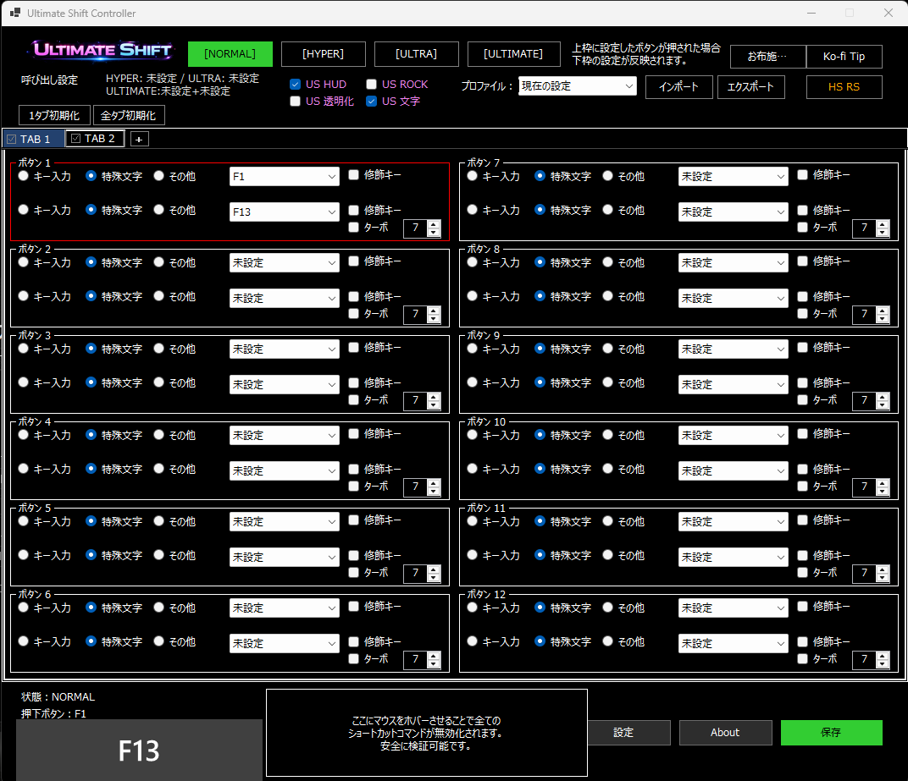

---

# 2. Razer Synapse 2で「マウス5番にF13」を割り当てる

次に <strong>Razer Synapse 2</strong> を起動して、

- ボタン<strong>5</strong>に <strong>F13</strong> を割り当てる
- 「キーボードの機能」にする
- 「キーのバインド先」が空白でも、<strong>F1キーを押す</strong>  
  → さっきの設定で <strong>F13が入力される</strong>
- 空欄でも保存できる＝<strong>単キー</strong>になってる

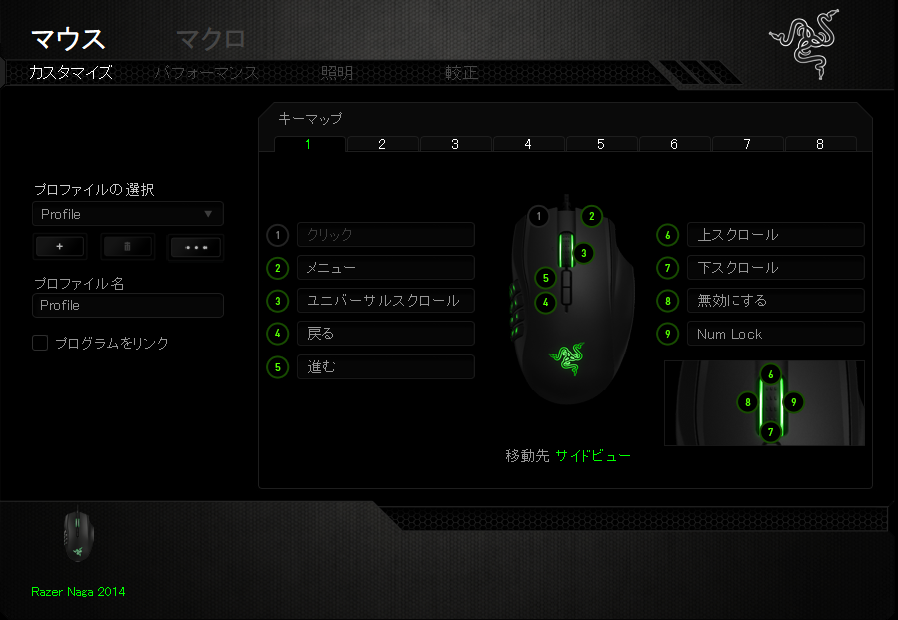
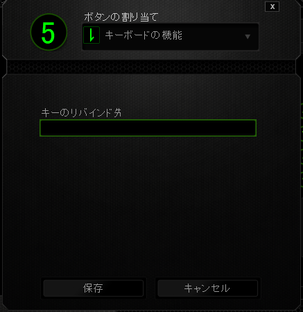

---

# 3. ここまでで「マウス5＝F13」になった（準備完了）

この時点で、物理的には

- <strong>マウス5を押す → F13が出る</strong>

という状態が完成。

（ここは環境によって画面が違ってもOK。要は「5がF13になってる」ことが重要）

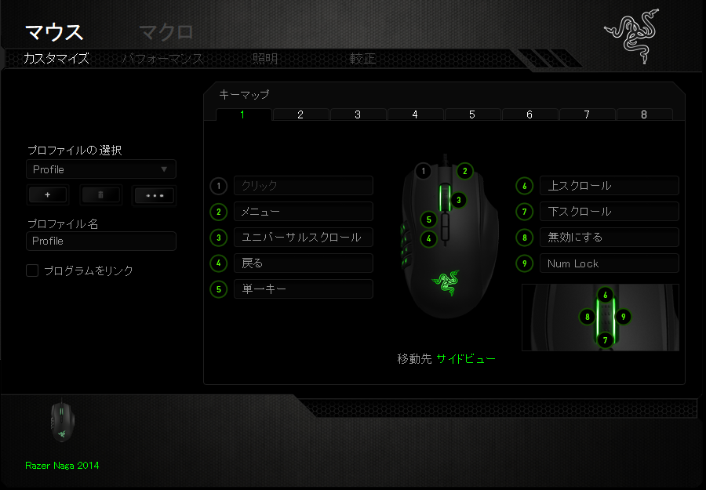

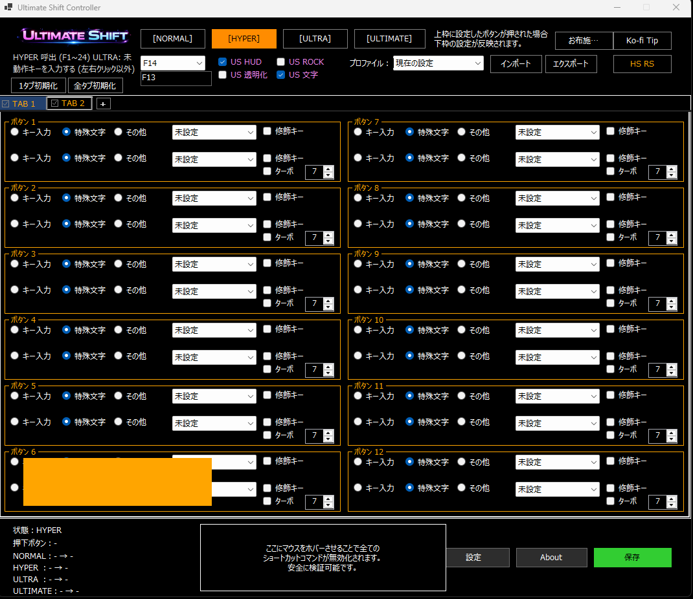
---

# 4. HYPERの設定をする（起爆：F13 / HYPER：F14）

ここが抜けてたやつ。  
UltimateShift側で <strong>HYPER世界</strong>を作る。

- <strong>HYPER＝F14</strong>
- <strong>起爆＝F13</strong>（＝マウス5で入れる）

これで「マウス5を押した瞬間、HYPERレイヤーの世界にいる」状態になる。  
あとはHYPER側に割り当てたい入力を足していく。タブ名変えて整理してもOK。

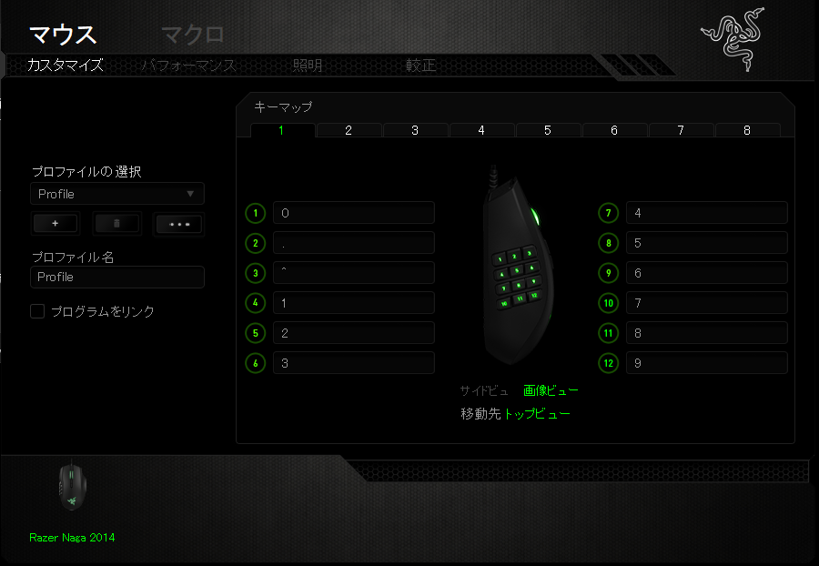
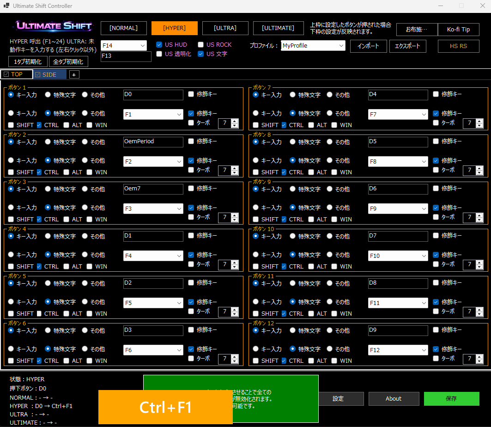
---

# 5. パッドでULTRA（パッドのL1＝ULTRA）

ここから <strong>パッド側でULTRA</strong> を作る。

- <strong>パッドのL1＝ULTRA</strong>
- 必要なら先に「パッド名設定」で分かりやすくする（任意だけど便利）
- 最終的に <strong>ULTRA＝F15</strong>（など）にして運用していく
- 
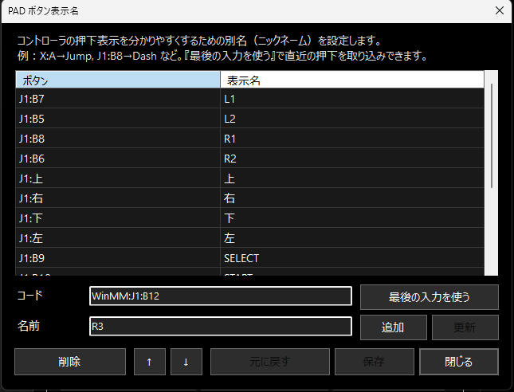

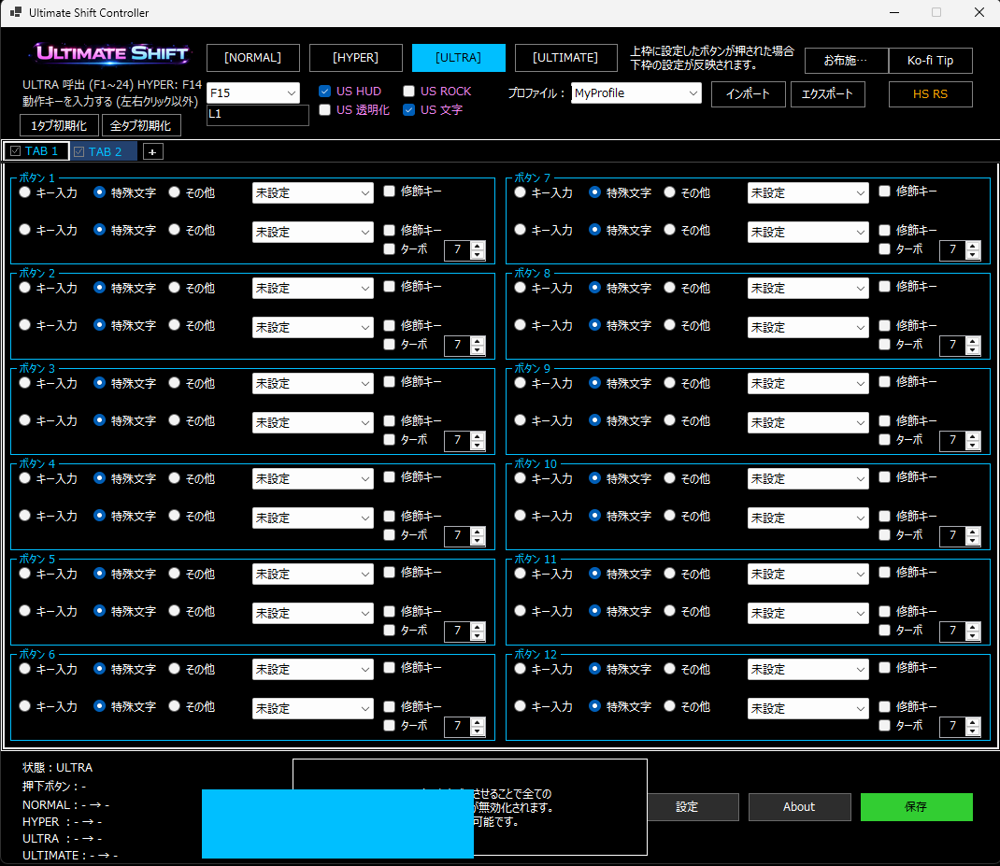

---

# 6. 同時押しでULTIMATE（HYPER＋ULTRA＝最上位）

- <strong>マウス5（HYPER）＋L1（ULTRA）</strong> を同時押し  
  → <strong>ULTIMATE世界</strong>

キーマウ単体やパッド＋多ボタンで使わない人もいるけど、  
<strong>L1/R1</strong> をレイヤー切替に使うと、体感の操作数が一気に増える。

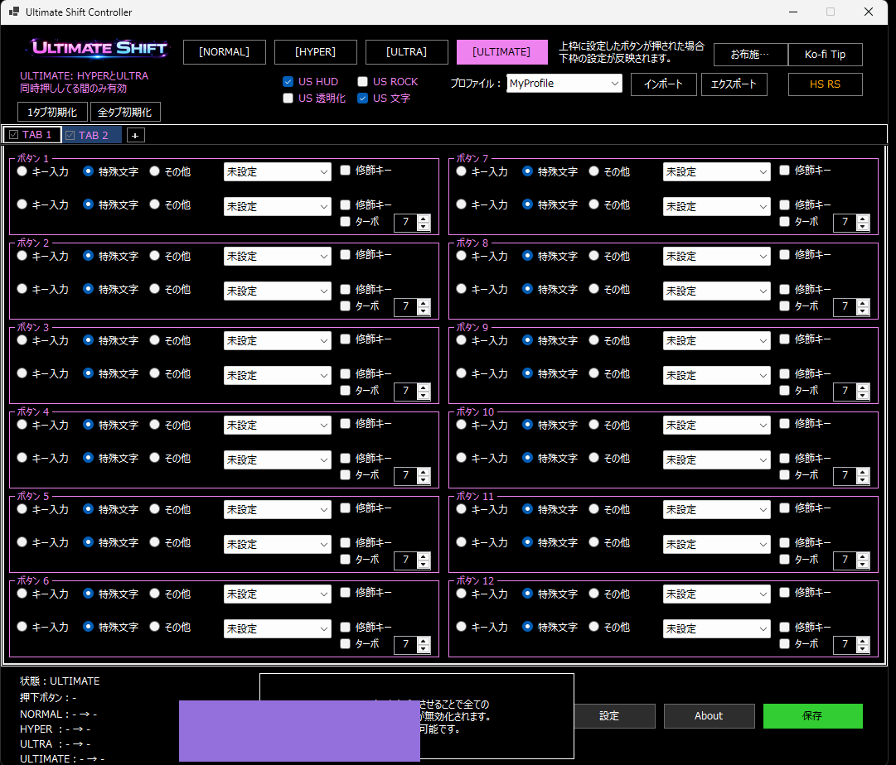

---

# 7. 仕上げ（割り当てを増やして完成）

ここまでできたら、あとはレイヤーごとに
「同じボタンに別の意味」を割り当てていくだけ。

- <strong>NORMAL</strong>：普段の操作
- <strong>HYPER</strong>：マウス5を押している間だけ別操作
- <strong>ULTRA</strong>：L1を押している間だけ別操作
- <strong>ULTIMATE</strong>：両方押している間だけ最終奥義

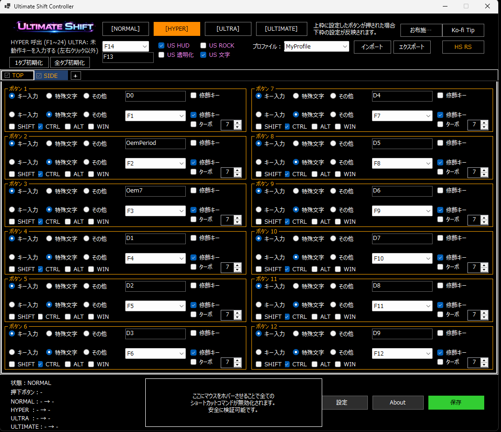

---

## まとめ

- マウス5＝<strong>HYPER</strong>
- パッドL1＝<strong>ULTRA</strong>
- 同時押し＝<strong>ULTIMATE</strong>

UltimateShiftは「ボタンを増やす」じゃなく、  
<strong>今どの世界にいるか</strong>を切り替える仕組み。
